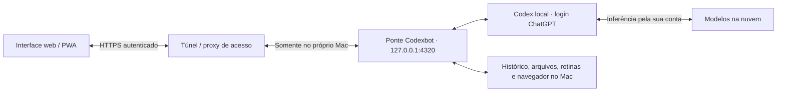

# A ponte com o Mac

O celular é o controle remoto. O Mac é onde o Codexbot coordena o trabalho: agentes, arquivos, navegador, rotinas e aprovações. O Codex usa seu login do ChatGPT para acessar os modelos na nuvem. Você não precisa manter a conversa aberta no celular para uma tarefa já iniciada continuar.

## O caminho de uma mensagem

1. Você envia uma instrução pela interface.
2. O caminho remoto verifica quem está acessando. O servidor também confere endereço, origem e identidade.
3. A ponte coloca a tarefa na fila do agente e conversa com o Codex instalado no Mac.
4. O agente usa os modelos e as ferramentas disponíveis, dentro das permissões e limites da conta. Ações que exigem revisão aparecem na interface.
5. O Mac registra o resultado; a interface recebe as atualizações. Notificações push podem avisar sobre respostas não lidas e aprovações pendentes.

**“Direta com o Mac” descreve o destino da ponte, não uma promessa de processamento inteiramente local nem de conexão sempre ponto a ponto.** Tailscale pode usar relays; um túnel público passa pelo provedor contratado. Prompts e conteúdo necessário ao trabalho podem ser enviados ao serviço de modelos e às ferramentas acionadas. O histórico persistido pelo aplicativo fica no Mac, mas isso não significa que nenhum dado saia dele.

## O que cada parte faz

| Parte | Responsabilidade |
| --- | --- |
| Interface web/PWA | Conversas, cards, uploads, revisão e visualização de resultados. Não hospeda os agentes. |
| Ponte Node.js | API, fila, persistência, rotinas, aprovação, anexos e integração com Codex. |
| Codex | Sessão autenticada com ChatGPT e execução das ferramentas disponíveis. |
| Chrome compartilhado | Navegação e sessões do usuário; não é uma VM isolada por agente. |
| Túnel/proxy | Transporte remoto e, quando configurado, autenticação antes de chegar à ponte. |
| Push | Entrega de avisos pelo serviço push do navegador/OS, com permissão do usuário. |

A voz em tempo real é experimental: a sinalização começa na ponte, e o áudio WebRTC segue entre navegador e serviço de voz. A transcrição local opcional usa o Mac. Os dois caminhos têm requisitos diferentes; veja [voz no README](../README.md#voice-messages-without-a-paid-speech-api).

## Fronteira de confiança atual

O servidor escuta apenas em `127.0.0.1`, por padrão na porta `4320`. O acesso local usa o token de pareamento entregue em `/connect`; esse endereço e seus links são privados.

Para o acesso remoto nativo, `.runtime/remote.json` registra uma única origem HTTPS e um único login autorizado. O servidor aceita a identidade `Tailscale-User-Login` somente quando a conexão vem do loopback e o `Host` corresponde à origem configurada. Também verifica `Origin` quando presente. CORS não substitui autenticação.

O modelo confia no Mac e nos proxies locais autorizados. Ele não protege contra um processo malicioso que já controla o Mac. Por isso, não se deve encaminhar tráfego público diretamente à porta local, reescrever `Host` para `localhost` para “resolver” um 403, nem preencher uma identidade fixa antes de autenticar o visitante.

Um gateway público pode adaptar uma identidade realmente verificada a esse contrato, mas **não há um login OIDC/Cloudflare nativo embutido no Codexbot**. Esse gateway é infraestrutura adicional. O aplicativo continua sendo um workspace de um proprietário, não um serviço multiusuário.

## Disponibilidade e privacidade

- O Mac precisa estar ligado, conectado e com o usuário logado. Algumas ferramentas exigem a sessão desbloqueada. Fechar o celular não desliga o agente; desligar o Mac interrompe a ponte.
- A instalação usa um LaunchAgent. Ele não executa antes do login no macOS. Suspensão e fechamento da tampa podem afetar disponibilidade.
- Rotinas dependem do Mac disponível; horários perdidos durante suspensão não são repostos automaticamente.
- `.private/` e `.runtime/` guardam dados privados. Não devem acompanhar o código, a landing ou um deploy estático.
- Publicar apenas a interface não publica nem substitui a ponte. Um frontend hospedado ainda precisa alcançar o Mac autorizado.
- A assinatura do ChatGPT precisa dar acesso ao Codex. Os limites do plano continuam valendo; túneis, domínio e provedores de identidade podem ter custos próprios.

## Próximo passo

Consulte [Acesso remoto seguro](remote-access.md): configuração Tailscale Serve, alternativa SSH e arquitetura para um endereço público com login obrigatório.

Referências de implementação: [server.mjs](../server.mjs), [lib.mjs](../lib.mjs), [configuration.mjs](../configuration.mjs), [install-service.mjs](../install-service.mjs). Revise essas verificações ao atualizar a infraestrutura.
