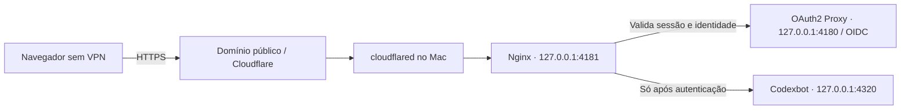

# Acesso remoto seguro ao Codexbot

Este guia documenta o código atual. Ele não abre portas nem configura túneis automaticamente. Exemplos usam domínios e identidades fictícios. Guarde valores reais e segredos somente em arquivos privados fora do Git.

**Recomendação para uso pessoal: Tailscale Serve.** Para abrir a interface em um navegador sem cliente VPN, use um endereço público com login obrigatório e um gateway de identidade. Um túnel sozinho resolve conectividade, não autorização.

| Método | Quem alcança o endereço | Situação no Codexbot |
| --- | --- | --- |
| Tailscale Serve | Dispositivos autorizados na tailnet | Integração de identidade existente; caminho recomendado. |
| Encaminhamento SSH | Cliente que autenticou no SSH | Alternativa para desktop com pareamento local. |
| Cloudflare Tunnel + gateway OIDC | Internet; aplicação só após login autorizado | Exige gateway e adaptação de cookies no frontend; referência abaixo. |
| Tailscale Funnel + gateway OIDC | Internet; aplicação só após login autorizado | Alternativa de transporte para o mesmo gateway; não encaminhar direto à ponte. |
| Reverse proxy próprio + OIDC | Internet; aplicação só após login autorizado | Exige TLS, gateway e operação do servidor. |

“Público seguro” significa **endereço público e conteúdo protegido**, não acesso anônimo aos agentes. A landing de apresentação pode ser pública sem expor o workspace.

## Antes de alterar uma instalação

Leia `.private/install.json` no checkout usado na instalação para descobrir diretório e rótulo do serviço. Não presuma o caminho de outra instalação. Confira tarefas em execução na interface; finalize-as antes de reiniciar. Faça backup privado de `.private/` e `.runtime/`, preservando permissões, e registre a configuração anterior do proxy. Não apague tokens, históricos ou perfis.

Os exemplos assumem porta `4320`. Ajuste se a instalação usa `CODEXBOT_PORT` ou o alias `EQUIPE_PORT`. Todos os comandos de configuração abaixo são executados pelo administrador, depois de substituir os exemplos pelos próprios valores.

## Tailscale Serve: configuração recomendada

### Conecte os dispositivos

Instale Tailscale no Mac e no celular pelos [downloads oficiais](https://tailscale.com/download). Entre na mesma conta proprietária, aprove os dispositivos e restrinja o acesso ao Mac na política da tailnet. Use um dispositivo cliente associado ao usuário: requisições originadas de dispositivos com tags não recebem os mesmos cabeçalhos de identidade.

No Mac, confira o estado antes de mudar qualquer rota:

```sh
tailscale status
tailscale serve status
tailscale funnel status
tailscale serve --help
curl --fail http://127.0.0.1:4320/health
```

A porta HTTPS escolhida não deve estar ocupada por outro serviço. Não substitua uma rota existente sem verificar seu uso. Habilite MagicDNS/HTTPS na tailnet se a configuração solicitar; o nome DNS do certificado pode aparecer em registros públicos de transparência de certificados.

### Encaminhe HTTPS ao servidor local

```sh
tailscale serve --bg --https=443 http://127.0.0.1:4320
tailscale serve status
```

Anote a URL HTTPS realmente informada. Serve fica restrito à tailnet; não ative Funnel nesse caminho. A referência da [CLI Serve](https://tailscale.com/docs/reference/tailscale-cli/serve) explica persistência e desativação.

### Registre a origem e o proprietário

Edite `.runtime/remote.json` **no diretório da instalação ativa**, não em uma cópia arbitrária do repo:

```json
{
  "origin": "https://your-mac.your-tailnet.ts.net",
  "login": "owner@example.com"
}
```

Use o login exato do proprietário no Tailscale e a origem exata, sem caminho ou barra final. Preserve outras configurações privadas. Proteja o arquivo com permissões restritas e reinicie somente o serviço identificado em `.private/install.json`, depois de verificar tarefas e backup. A configuração remota é carregada na inicialização.

Abra a URL no celular com Tailscale conectado. O Serve remove cabeçalhos de identidade recebidos do cliente e acrescenta a identidade verificada. Codexbot compara essa identidade, `Host` e loopback. **Funnel não fornece a identidade de visitantes da internet.** Consulte [identidade no Serve](https://tailscale.com/docs/features/tailscale-serve#identity-headers).

### Valide e instale a PWA

- Seu dispositivo autorizado abre o painel e carrega as conversas.
- Outro usuário, mesmo com acesso de rede ao Mac, não ganha acesso ao workspace do proprietário.
- Com Tailscale desligado, o endereço privado deixa de ser acessível; isso é esperado.
- Nenhuma rota Funnel pública encaminha à porta `4320`.
- Envie uma tarefa simples, teste uma aprovação e baixe um anexo de exemplo.

No iPhone/iPad, abra no Safari e use **Compartilhar → Adicionar à Tela de Início**. Abra a PWA instalada antes de ativar push. No Android, instale pelo Chrome. Microfone e push dependem de HTTPS, suporte do navegador/OS e permissão. Veja [requisitos mobile](../README.md#mobile-access-installation-and-notifications).

Para retirar apenas essa rota, confirme a sintaxe na CLI instalada e use o comando correspondente:

```sh
tailscale serve --https=443 off
```

Evite `serve reset` em uma máquina que hospeda outros serviços.

## SSH: alternativa para outro computador

Se você já tem acesso SSH seguro ao Mac, um túnel local permite usar o fluxo de pareamento existente. No computador cliente, com a porta `4320` livre:

```sh
ssh -N -o ExitOnForwardFailure=yes -L 127.0.0.1:4320:127.0.0.1:4320 mac-user@mac-host
```

Abra `http://127.0.0.1:4320/connect` nesse cliente. O navegador estará conectado ao loopback do Mac pelo SSH. A página contém um link privado com o token de pareamento: não compartilhe, grave nem publique esse link. Verifique a chave do host SSH e use autenticação por chave. A sessão do túnel precisa permanecer aberta; `Ctrl+C` encerra o encaminhamento. Usar a mesma porta evita incompatibilidade com a allowlist de Host/Origin atual.

Esse caminho não é um endereço público e não é a opção prática para PWA no celular. Não use `-g` nem faça bind em `0.0.0.0`. Veja o [manual do OpenSSH](https://man.openbsd.org/ssh.1#L).

## Endereço público: Cloudflare Tunnel + gateway com login

**Configuração avançada de referência, não instalada nem homologada automaticamente pelo Codexbot.** Requer domínio, provedor OIDC, OAuth2 Proxy e Nginx com `auth_request`. Verifique as opções nas versões instaladas e passe pelos testes de rejeição abaixo antes de uso real. Não há alteração no código da ponte neste guia.



A adaptação essencial é esta: o gateway obtém o email **da resposta autenticada** do OAuth2 Proxy e o encaminha no cabeçalho que a ponte já reconhece. Nunca use um email vindo do navegador nem injete um login fixo em uma rota sem autenticação. O backend ainda exige correspondência exata com o proprietário configurado.

### Pré-requisito de compatibilidade: cookies do frontend

**O frontend atual ainda não funciona integralmente com esse login baseado em cookie.** Em `dist/app.js`, o helper `api()`, o upload de anexos (`addFiles`) e o upload de áudio usam `credentials: local ? 'same-origin' : 'omit'`. Em um domínio público, isso omite o cookie mesmo quando interface e API estão na mesma origem. O resultado esperado sem adaptação é: login abre a página, mas as chamadas API recebem 401.

Antes de publicar este caminho, implemente e revise nesses três pontos uma política equivalente a:

```js
// Apenas para frontend e API no mesmo domínio autenticado.
const bridgeCredentials = new URL(API).origin === location.origin
  ? 'same-origin'
  : 'omit';
// Em cada fetch destinado à ponte:
// credentials: bridgeCredentials
```

Não use `include` indiscriminadamente nem envie cookies a uma ponte de outra origem. Audite novos pontos de fetch, teste uploads, voz, sessão expirada e logout. Essa mudança é um pré-requisito documentado, **não foi aplicada pelo guia**. O caminho Tailscale Serve não depende desses cookies e continua sendo o método pronto para uso.

### Configure a identidade primeiro

No provedor OIDC, crie um cliente web para `https://bot.example.com/oauth2/callback`, com autorização apenas para seu proprietário e MFA. Use email verificado, issuer e audience corretos. Instale versões mantidas de OAuth2 Proxy e Nginx pelos canais oficiais.

Guarde uma configuração privada do OAuth2 Proxy baseada nestes campos (substitua os caminhos absolutos de exemplo). Client secret e cookie secret devem ser fornecidos por arquivos/ambiente privados, não colocados neste repo, na linha de comando ou no JavaScript do frontend:

```toml
provider = "oidc"
oidc_issuer_url = "https://identity.example.com"
client_id = "REPLACE_WITH_YOUR_CLIENT_ID"
redirect_url = "https://bot.example.com/oauth2/callback"
http_address = "127.0.0.1:4180"
reverse_proxy = true
upstreams = ["static://202"]
set_xauthrequest = true
authenticated_emails_file = "/PRIVATE/allowed-emails.txt"
scope = "openid profile email"
code_challenge_method = "S256"
insecure_oidc_allow_unverified_email = false
insecure_oidc_skip_issuer_verification = false
insecure_oidc_skip_nonce = false
cookie_name = "__Host-codexbot_login"
cookie_secure = true
cookie_httponly = true
cookie_path = "/"
cookie_samesite = "lax"
cookie_expire = "1h"
cookie_refresh = "0"
request_logging = false
```

O arquivo de emails deve conter somente o email autorizado, por exemplo `owner@example.com`. Não adicione `email_domains = ["*"]`. Gere um cookie secret criptograficamente aleatório conforme a documentação; não reutilize o token local do Codexbot. Consulte [opções OAuth2 Proxy](https://oauth2-proxy.github.io/oauth2-proxy/7.8.x/configuration/overview/) e a documentação correspondente à sua versão.

### Faça o gateway autenticar todas as rotas da aplicação

Este bloco vai no contexto `http` da configuração privada do Nginx. O servidor de login é a única exceção pública. O exemplo exige login novamente ao expirar a sessão; não implementa renovação silenciosa de cookies divididos.

```nginx
server {
    listen 127.0.0.1:4181 default_server;
    server_name _;
    return 444;
}
server {
    listen 127.0.0.1:4181;
    server_name bot.example.com;
    access_log off;
    client_max_body_size 100m;

    location = /oauth2/auth {
        internal;
        proxy_pass http://127.0.0.1:4180;
        proxy_pass_request_body off;
        proxy_set_header Content-Length "";
        proxy_set_header Host bot.example.com;
        proxy_set_header X-Forwarded-Proto https;
        proxy_set_header X-Forwarded-Host bot.example.com;
        proxy_set_header X-Forwarded-For $remote_addr;
        proxy_set_header X-Original-URI $request_uri;
    }
    location /oauth2/ {
        proxy_pass http://127.0.0.1:4180;
        proxy_set_header Host bot.example.com;
        proxy_set_header X-Forwarded-Proto https;
        proxy_set_header X-Forwarded-Host bot.example.com;
        proxy_set_header X-Forwarded-For $remote_addr;
        proxy_set_header X-Auth-Request-Redirect https://bot.example.com/;
    }
    location = /connect { return 404; }
    location ~ ^/a2a(?:/|$) { return 404; }

    location / {
        auth_request /oauth2/auth;
        auth_request_set $verified_email $upstream_http_x_auth_request_email;
        # Unauthenticated API calls fail rather than receiving an HTML login page.
        # Start login explicitly at /oauth2/start?rd=/.
        proxy_pass http://127.0.0.1:4320;
        proxy_set_header Host bot.example.com;
        proxy_set_header Tailscale-User-Login $verified_email;
        proxy_set_header Tailscale-User-Name "";
        proxy_set_header Tailscale-User-Profile-Pic "";
        proxy_set_header Authorization "";
        proxy_set_header X-Forwarded-Proto https;
        proxy_set_header X-Forwarded-Host bot.example.com;
        proxy_set_header X-Forwarded-For $remote_addr;
        proxy_read_timeout 240s;
        proxy_buffering off;
    }
}
```

O `Cookie` da sessão chega ao OAuth2 Proxy no subrequest. A identidade usada na ponte vem de `$upstream_http_x_auth_request_email`, não de `$http_x_auth_request_email`. O cabeçalho recebido `Tailscale-User-Login` é substituído, nunca preservado. Não crie exceções de autenticação para `/api/`, anexos, voz ou notificações. A2A público fica fora deste exemplo e exige projeto próprio de autorização.

O Nginx deve ter o [módulo auth_request](https://nginx.org/en/docs/http/ngx_http_auth_request_module.html). Confira `nginx -V`, valide com `nginx -t -c /ABSOLUTE/PRIVATE/nginx.conf` e execute os serviços com seus arquivos privados. Referência: [integração OAuth2 Proxy/Nginx](https://oauth2-proxy.github.io/oauth2-proxy/7.8.x/configuration/integration/).

Na instalação do Codexbot, configure `.runtime/remote.json` com a origem pública `https://bot.example.com` e `login` igual ao email OIDC verificado `owner@example.com`. Apesar do nome legado do cabeçalho, aqui a identidade é garantida pelo gateway OIDC. Isso substitui a origem remota anterior: o código atual aceita uma só origem remota, não dois domínios simultâneos. Reinicie a ponte somente após o procedimento de manutenção inicial.

### Crie o túnel para o gateway, nunca diretamente para 4320

Instale `cloudflared` pelo canal oficial, autentique sua conta e crie um túnel nomeado:

```sh
cloudflared tunnel login
cloudflared tunnel create codexbot-private-gateway
```

Em arquivo privado, use o UUID e o caminho de credenciais gerados:

```yaml
tunnel: REPLACE_WITH_TUNNEL_UUID
credentials-file: /ABSOLUTE/PRIVATE/REPLACE_WITH_TUNNEL_UUID.json
ingress:
  - hostname: bot.example.com
    service: http://127.0.0.1:4181
    originRequest:
      httpHostHeader: bot.example.com
  - service: http_status:404
```

Valide a regra antes de criar a rota DNS e iniciar o túnel:

```sh
cloudflared tunnel --config /ABSOLUTE/PRIVATE/tunnel.yml ingress validate
cloudflared tunnel route dns codexbot-private-gateway bot.example.com
cloudflared tunnel --config /ABSOLUTE/PRIVATE/tunnel.yml run codexbot-private-gateway
```

Configure HTTPS obrigatório na borda e desative cache para esse hostname. Abra `https://bot.example.com/oauth2/start?rd=/`, autentique-se e use o painel no mesmo domínio. Não configure um frontend em outra origem para esse exemplo: a sessão depende de cookies same-origin e da adaptação descrita acima. Valide também os limites de upload e timeout do provedor de túnel, especialmente na transcrição. Serviços permanentes, rotação de segredos e revogação de sessões precisam ser operados pelo administrador.

Referências: [criar túnel nomeado](https://developers.cloudflare.com/tunnel/features/locally-managed-tunnels/create-local-tunnel/) e [regras de ingresso](https://developers.cloudflare.com/tunnel/features/locally-managed-tunnels/configuration-file/).

### Se preferir Cloudflare Access

Access pode ser a camada de login, substituindo o OAuth2 Proxy, mas **não basta trocar os cabeçalhos por email**. Configure uma política restrita ao proprietário, valide o JWT Access (assinatura, issuer, audience e expiração) no conector/gateway e só então mapeie a identidade para a ponte. O exemplo Nginx acima é para OAuth2 Proxy, não é um validador JWT Access. Use um adaptador validado para esse caminho; ele não vem no repo. [Configuração oficial Access](https://developers.cloudflare.com/cloudflare-one/access-controls/applications/http-apps/self-hosted-public-app/) e [validação do token](https://developers.cloudflare.com/cloudflare-one/access-controls/applications/http-apps/authorization-cookie/application-token/).

## Outros transportes públicos

**Tailscale Funnel:** encaminhe ao gateway autenticado `127.0.0.1:4181`, nunca diretamente à ponte. Ajuste o hostname Nginx, callback OIDC e `remote.json` para o endereço HTTPS efetivo antes de ativá-lo. O login público passa a ser OIDC; visitantes públicos não terão identidade Tailscale. Serve e Funnel na mesma porta não coexistem como privado e público. Confirme suporte do cliente e use [a referência Funnel](https://tailscale.com/docs/features/tailscale-funnel) para ativação e retirada. Não execute um comando Funnel como atalho para corrigir problemas no Serve.

**VPS/reverse proxy próprio:** termine TLS e autentique no gateway. Leve tráfego do gateway ao Mac por um transporte privado autenticado, como SSH reverso vinculado exclusivamente ao loopback do VPS. A identidade precisa vir apenas desse gateway e a origem final no Mac deve continuar local. Não publique o listener do túnel reverso. Essa topologia exige projeto de firewall, TLS, confiança entre proxies e recuperação de conexão; não é uma instalação automática suportada pelo app.

## Testes obrigatórios antes de usar um endereço público

| Verificação | Resultado esperado |
| --- | --- |
| Sem cookie em `/`, `/api/state`, `/api/files/qualquer-id` | 401/403; nenhum dado do workspace. |
| Enviar manualmente `Tailscale-User-Login` ou `X-Auth-Request-Email` sem sessão | Continua negado. |
| Login com outra conta | Negado pela allowlist e pela ponte. |
| Sessão expirada, inválida ou usuário revogado | Acesso negado; verificar prazo de revogação real do provedor/gateway. |
| Gateway/OAuth2 Proxy parado | Falha fechada; nenhum fallback direto à porta 4320. |
| Host ou Origin não configurado | Negado. |
| `/connect` e `/a2a` no domínio público deste exemplo | 404. |
| API, anexos, cards e voz com proprietário autenticado | Funcionam, respeitando permissões e limites. |
| Mac fora de rede | Indisponível; não revelar detalhes privados em páginas de erro. |

Exemplo de teste negativo, com seu domínio público substituído:

```sh
curl -i https://bot.example.com/api/state
curl -i -H 'Tailscale-User-Login: owner@example.com' https://bot.example.com/api/state
curl -i -H 'X-Auth-Request-Email: owner@example.com' https://bot.example.com/api/state
```

Não cole cookies, tokens ou respostas privadas em issues. Mesmo autenticado, o usuário tem poderes sobre um Mac: mantenha a allowlist limitada ao proprietário. Teste também a PWA após logout; um shell estático em cache não deve conseguir buscar dados da API sem sessão.

## Diagnóstico e retirada

- **403 no Serve:** confira login exato, Host, cliente Tailscale conectado e ausência de tags no dispositivo cliente. Não remova `remoteAuthorized` nem force um login no proxy para contornar o erro.
- **401 local:** abra `/connect` somente pelo caminho local/SSH autorizado e faça o pareamento.
- **Login público funciona, API dá 403:** verifique email autenticado, origem em `remote.json`, Host literal e se a requisição final chega por loopback. Não substitua Host por `localhost`.
- **502:** confira ponte, gateway, login e conector separadamente. Não crie bypass temporário de autenticação.
- **PWA/voz/push falha:** teste HTTPS, permissões, sessão, conectividade e Mac ligado. WebRTC usa transporte de mídia separado do HTTP.
- **Frontend hospedado separado:** a origem permitida fica em `.private/config.json` (`siteOrigin`); isso não concede identidade nem dispensa acesso à ponte. Prefira same-origin no gateway público.

Para retirar acesso público, pare o conector e remova a rota DNS/ingresso dedicada; confirme de uma rede externa que deixou de funcionar. Revogue sessões no gateway/provedor e restaure a configuração anterior de `remote.json` com backup. Retire apenas os serviços criados para essa ponte. Nunca use a remoção do túnel como motivo para apagar os dados do Codexbot.
